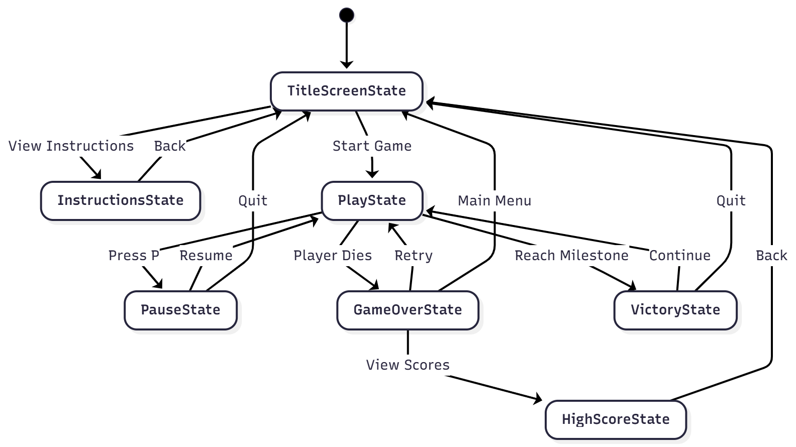
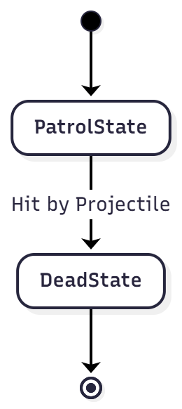
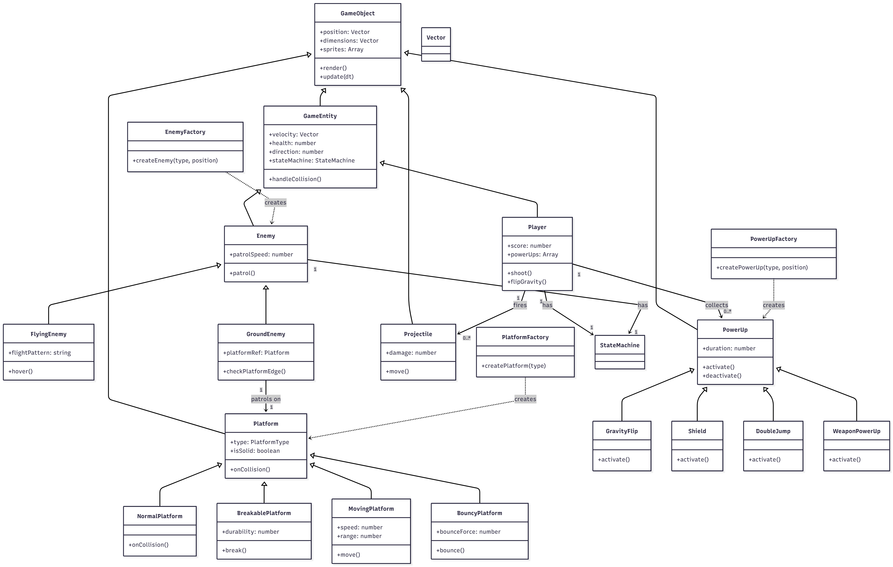
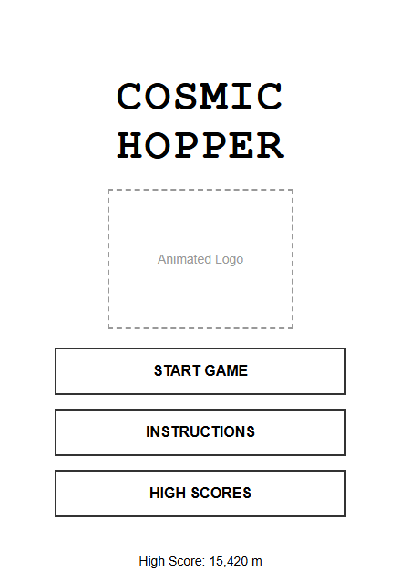
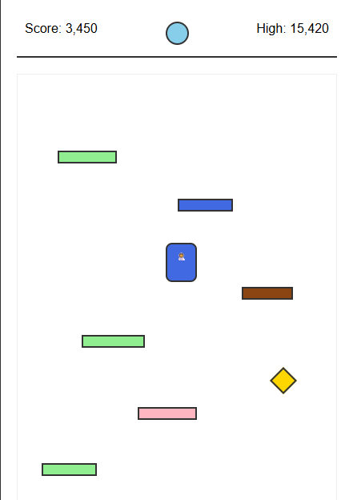
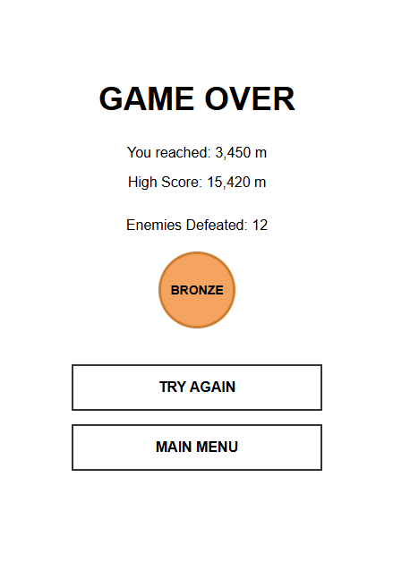
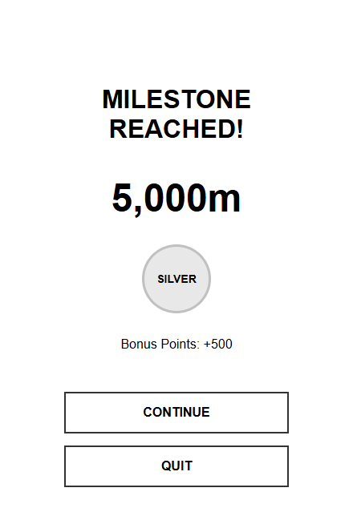
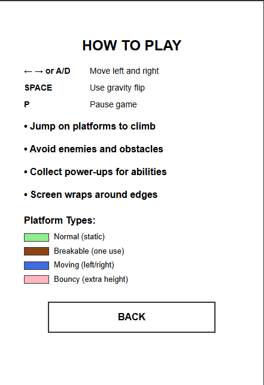

# Final Project

- [ ] Read the [project requirements](https://vikramsinghmtl.github.io/420-5P6-Game-Programming/project/requirements).
- [ ] Replace the sample proposal below with the one for your game idea.
- [ ] Get the proposal greenlit by Vik.
- [ ] Place any assets in `assets/` and remember to update `src/config.json`.
- [ ] Decide on a height and width inside `src/globals.js`. The height and width will most likely be determined based on the size of the assets you find.
- [ ] Start building the individual components of your game, constantly referring to the proposal you wrote to keep yourself on track.
- [ ] Good luck, you got this!

---

# Cosmic Hopper

## Description

Cosmic Hopper is a vertical platformer where a player controls an astronaut character trying to escape from a collapsing alien planet. The player must jump from platform to platform, ascending infinitely while avoiding obstacles and enemies. Unlike traditional Doodle Jump, this version features a gravity shift mechanic where the player can temporarily reverse gravity to reach special platforms and collect power-ups.

This is an endless vertical platformer with action/arcade elements and roguelike progression. Players automatically jump when landing on platforms and must navigate increasingly difficult challenges as they climb higher.

## Gameplay

Players automatically jump when landing on platforms. The game starts with a coin flip to determine initial platform generation seed. Players draw their starting position and must immediately begin climbing.

The core gameplay loop involves:
- Moving left and right while airborne using arrow keys or A/D keys
- Landing on various platform types (normal, breakable, moving, bouncy)
- Avoiding or defeating enemies that patrol platforms or fly around
- Collecting power-ups including gravity flip, shield, and double jump (WIP)
- Using the spacebar to activate power-up when the power-up is collected
- Managing increasing difficulty as height increases
- Screen wrapping (exit left side, appear on right side)
- Tracking score based on height achieved (maybe enemies increase score)

**Victory Conditions:**
- Reach milestone heights to earn medals: 1000m (Bronze), 5000m (Silver), 10000m (Gold)
- Game continues infinitely after gold medal for high score chasing

**Loss Conditions:**
- Fall off the bottom of the screen
- Collide with an enemy without shield protection

**Controls:**
- Arrow Keys / A & D: Move left and right
- Spacebar: Activate power-up (when power-up is collected)
- Mouse Click: Navigate menus and restart game
- P Key: Pause game

## Requirements

1. The system shall randomly generate the initial platform layout.
2. The player shall move left and right while airborne.
3. The player shall automatically jump upon landing on a platform.
4. The system shall implement screen wrapping for horizontal movement.
5. The player shall collect power-ups for special abilities.
6. The player shall shoot projectiles to defeat enemies (when weapon power-up is active).
7. The player shall use gravity flip to reverse gravity temporarily.
8. The system shall spawn platforms procedurally as the player climbs.
9. The system shall spawn enemies on platforms and in the air.
10. The system shall increase difficulty every 1000 meters.
11. The player shall view current score, high score, and active power-ups on the HUD.
12. The system shall detect collisions between player and platforms (top-only collision).
13. The system shall detect collisions between player and enemies.
14. The system shall detect collisions between projectiles and enemies.
15. The system shall detect when the player falls off the bottom of the screen.
16. The player shall pause the game and resume or quit to main menu.
17. The system shall save high scores to local storage.
18. The system shall save game state for resume functionality.
19. The system shall award milestone medals at specific heights.
20. The system shall display game over screen with final statistics.
21. The player shall retry after game over or return to main menu.
22. The player shall view instructions before starting the game.
23. The player shall view high scores from the main menu.
24. The system shall track combo multipliers for consecutive enemy defeats.
25. The system shall unlock character skins based on achievements.
26. The player shall continue playing infinitely after reaching gold medal.

### State Diagrams

#### Game State Machine

#### Player Entity State Machine

#### Enemy Entity State Machine

#### Class Diagram

#### Wireframes

#### Title Screen

#### Play State (Main Gameplay)

#### Game Over Screen

#### Victory State (Milestone Reached)

#### Instructions Screen

### 🎨 Assets

#### 🖼️ Images

**Sources:**
- [Kenney.nl](https://kenney.nl) - Space Shooter Asset Pack
- [itch.io](https://itch.io) - Pixel Adventure Assets
- [OpenGameArt](https://opengameart.org) - Platform Game Assets

**Required Sprites:**
- Player Character: Space-themed character sprite sheet with animations for idle, jumping, falling, shooting
- Platforms: 4 types (normal, breakable, moving, bouncy) with different visual styles
- Enemies: 2-3 enemy types (alien creature, flying saucer, space creature)
- Power-ups: Icons for gravity flip, shield, double jump, weapon
- Background: Parallax layers showing alien planet surface, atmosphere, and space
- UI Elements: Hearts for health, buttons, score displays, medal icons

#### ✏️ Fonts

- **Press Start 2P**: Retro pixel font for title and headers
- **Orbitron**: Futuristic sans-serif for score and UI elements
- **Roboto**: Clean and readable font for instructions

**Sources:**
- [Google Fonts](https://fonts.google.com)
- [DaFont](https://www.dafont.com) - Pixel Fonts

#### 🔊 Sounds

**Sound Effects:**
- Jump: Soft bounce/spring sound
- Enemy Hit: Alien squeal or explosion
- Power-up Collect: Chime or positive jingle
- Shoot: Laser blast
- Platform Break: Cracking sound
- Game Over: Descending tone
- Victory: Triumphant fanfare
- Gravity Flip: Whoosh/swoosh sound

**Music:**
- Title Screen: Upbeat space-themed menu music
- Gameplay: Energetic looping track that increases tempo as player climbs
- Victory: Short celebratory jingle

**Sources:**
- [Freesound.org](https://freesound.org)
- [OpenGameArt](https://opengameart.org) - Sound Effects
- [Incompetech](https://incompetech.com) - Royalty Free Music

### 📚 References

- Doodle Jump - Core vertical platformer mechanics
- Jetpack Joyride - Endless runner progression system
- Super Mario Bros - Platform collision and enemy behavior patterns